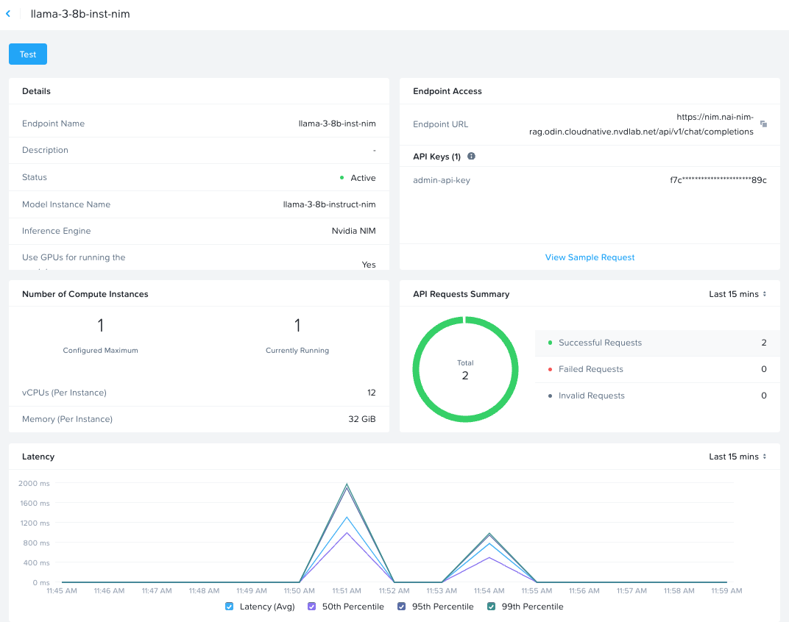

# Build an AI Chatbot with RAG with Nutanix Enterprise AI (NAI) - Deployment Workflow

This high level is based on the Multi-Rag ChatBot Scenario covered in [Build an AI Chatbot with RAG NVIDIA](https://catalog.ngc.nvidia.com/orgs/nvidia/teams/aiworkflows/collections/ai-chatbot-with-rag) collection and is intended to demonstrate leveraging Nutanix Enterprise AI 
as an alternative method for hosting LLM Inferencing Service

https://catalog.ngc.nvidia.com/orgs/nvidia/teams/aiworkflows/collections/ai-chatbot-with-rag

## Deploy [NVIDIA RAG Application: Multiturn Chatbot](https://catalog.ngc.nvidia.com/orgs/nvidia/teams/aiworkflows/helm-charts/rag-app-multiturn-chatbot)

### Pre-requisites

- [NGC ClI](https://org.ngc.nvidia.com/setup/installers/cli)
- Docker
- Kubectl
- Helm

```bash
## validate that you can view/pull images via ngcli and docker
export NGC_CLI_API_KEY=nvapi-<>

## set local ngc config
ngc config set --auth-option api-key

## example output
$ ngc config set --auth-option api-key
Enter API key [****KDJV]. Choices: [<VALID_APIKEY>, 'no-apikey']: 
Enter CLI output format type [ascii]. Choices: ['ascii', 'csv', 'json']: 
Enter org [<>]. Choices: ['<>']: 
Enter team [no-team]. Choices: ['no-team']: 
Enter ace [no-ace]. Choices: ['no-ace']: 
Validating configuration...
Successfully validated configuration.
Saving configuration...
Successfully saved NGC configuration to /Users/jesse.gonzalez/.ngc/config

## validate that you can access images from ngc registry and get latest tag info
ngc registry image info nvcr.io/nim/nvidia/nv-embedqa-e5-v5
ngc registry image info nvcr.io/nim/nvidia/nv-rerankqa-mistral-4b-v3
ngc registry image info nvcr.io/nvidia/aiworkflows/rag-application-multiturn-chatbot
ngc registry image info nvcr.io/nvidia/aiworkflows/rag-playground

## validate that you can access helm charts from ngc registry and get latest tag info
ngc registry chart info nim/nvidia/text-embedding-nim
ngc registry chart info nim/nvidia/text-reranking-nim
ngc registry chart info nvidia/aiworkflows/rag-app-multiturn-chatbot

## set latest tags for each image
export EMBEDDING_MODEL_IMAGE_VERSION=$(ngc registry image info nvcr.io/nim/nvidia/nv-embedqa-e5-v5 | grep "Latest Tag" | cut -d : -f2 | tr -d ' ')
export RETRIEVER_RANKING_MODEL_IMAGE_VERSION=$(ngc registry image info nvcr.io/nim/nvidia/nv-rerankqa-mistral-4b-v3 | grep "Latest Tag" | cut -d : -f2 | tr -d ' ')
export RAG_APPLICATION_MULTITURN_CHATBOT_IMAGE_VERSION=$(ngc registry image info nvcr.io/nvidia/aiworkflows/rag-application-multiturn-chatbot | grep "Latest Tag" | cut -d : -f2 | tr -d ' ')
export RAG_PLAYGROUND_IMAGE_VERSION=$(ngc registry image info nvcr.io/nvidia/aiworkflows/rag-playground | grep "Latest Tag" | cut -d : -f2 | tr -d ' ')

echo $EMBEDDING_MODEL_IMAGE_VERSION
echo $RETRIEVER_RANKING_MODEL_IMAGE_VERSION
echo $RAG_APPLICATION_MULTITURN_CHATBOT_IMAGE_VERSION
echo $RAG_PLAYGROUND_IMAGE_VERSION

## validate that you can login via docker and pull necessary images. enter nv-api key when prompted
docker login

## example output. when prompted enter $oauthtoken and nv-api key
$ docker login nvcr.io
Username: $oauthtoken
Password: 
Login Succeeded

## validate that images can be pulled via docker
docker pull nvcr.io/nim/nvidia/nv-embedqa-e5-v5:$EMBEDDING_MODEL_IMAGE_VERSION
docker pull nvcr.io/nim/nvidia/nv-rerankqa-mistral-4b-v3:$RETRIEVER_RANKING_MODEL_IMAGE_VERSION
docker pull nvcr.io/nvidia/aiworkflows/rag-application-multiturn-chatbot:$RAG_APPLICATION_MULTITURN_CHATBOT_IMAGE_VERSION
docker pull nvcr.io/nvidia/aiworkflows/rag-playground:$RAG_PLAYGROUND_IMAGE_VERSION
```

### Fetch Helm Charts

Download helm charts locally

```bash

## set latest tags for each chart
export EMBEDDING_MODEL_CHART_VERSION=$(ngc registry chart info nim/nvidia/text-embedding-nim | grep -i "Latest Version ID" | cut -d : -f2 | tr -d ' ')
export RETRIEVER_RANKING_MODEL_CHART_VERSION=$(ngc registry chart info nim/nvidia/text-reranking-nim | grep -i "Latest Version ID" | cut -d : -f2 | tr -d ' ')
export RAG_APPLICATION_MULTITURN_CHATBOT_CHART_VERSION=$(ngc registry chart info nvidia/aiworkflows/rag-app-multiturn-chatbot | grep -i "Latest Version ID" | cut -d : -f2 | tr -d ' ')

echo $EMBEDDING_MODEL_CHART_VERSION
echo $RETRIEVER_RANKING_MODEL_CHART_VERSION
echo $RAG_APPLICATION_MULTITURN_CHATBOT_CHART_VERSION

## fetch helm charts
## using -d uploaded_files/helm-charts as it's in gitignore
mkdir -p uploaded_files/helm-charts

helm fetch -d uploaded_files/helm-charts https://helm.ngc.nvidia.com/nim/nvidia/charts/text-embedding-nim-$EMBEDDING_MODEL_CHART_VERSION.tgz --username='$oauthtoken' --password=$NGC_CLI_API_KEY
helm fetch -d uploaded_files/helm-charts https://helm.ngc.nvidia.com/nim/nvidia/charts/text-reranking-nim-$RETRIEVER_RANKING_MODEL_CHART_VERSION.tgz --username='$oauthtoken' --password=$NGC_CLI_API_KEY
helm fetch -d uploaded_files/helm-charts https://helm.ngc.nvidia.com/nvidia/aiworkflows/charts/rag-app-multiturn-chatbot-$RAG_APPLICATION_MULTITURN_CHATBOT_CHART_VERSION.tgz --username='$oauthtoken' --password=$NGC_CLI_API_KEY

## untar helm charts 
tar xvf uploaded_files/helm-charts/text-embedding-nim-$EMBEDDING_MODEL_CHART_VERSION.tgz -C uploaded_files/helm-charts/
tar xvf uploaded_files/helm-charts/text-reranking-nim-$RETRIEVER_RANKING_MODEL_CHART_VERSION.tgz -C uploaded_files/helm-charts/
tar xvf uploaded_files/helm-charts/rag-app-multiturn-chatbot-$RAG_APPLICATION_MULTITURN_CHATBOT_CHART_VERSION.tgz -C uploaded_files/helm-charts/

```

### Deploying [NVIDIA Nemo Retriever Embedding Microservice](https://catalog.ngc.nvidia.com/orgs/nim/teams/nvidia/helm-charts/text-embedding-nim)

https://catalog.ngc.nvidia.com/orgs/nim/teams/nvidia/helm-charts/text-embedding-nim

```bash
## set required vars
export NGC_CLI_API_KEY="nvapi-<>"
EMBEDDING_MODEL_IMAGE_VERSION=$(ngc registry image info nvcr.io/nim/nvidia/nv-embedqa-e5-v5 | grep "Latest Tag" | cut -d : -f2 | tr -d ' ')

## base64 encode the NGC_CLI_API_KEY secret as helm chart doesn't handle
NGC_CLI_API_KEY_BASE64=$(echo -n ${NGC_CLI_API_KEY} | base64)

## run helm install - simple
helm upgrade --install \
  nemo-embedder \
  --namespace nrem \
  --create-namespace \
  --set image.repository=nvcr.io/nim/nvidia/nv-embedqa-e5-v5 \
  --set image.tag=$EMBEDDING_MODEL_IMAGE_VERSION \
  --set imagePullSecret.password=$NGC_CLI_API_KEY_BASE64 \
  --set imagePullSecret.create=true \
  --set persistence.retain=false \
  uploaded_files/helm-charts/text-embedding-nim \
  --wait

## validation steps
kubectl get pods -n nrem

kubectl port-forward -n nrem service/nemo-embedding-ms 8080:8080

curl -X 'POST' \
    'http://localhost:8080/v1/embeddings' \
    -H 'accept: application/json' \
    -H 'Content-Type: application/json' \
    -d '{
    "input": "hello world",
    "model": "nvidia/nv-embedqa-e5-v5",
    "input_type": "passage"
}'
```

## Deploy [Retriever Ranking](https://catalog.ngc.nvidia.com/orgs/nim/teams/nvidia/helm-charts/text-reranking-nim)

https://catalog.ngc.nvidia.com/orgs/nim/teams/nvidia/helm-charts/text-reranking-nim

```bash
## set required vars
export RETRIEVER_RANKING_MODEL_IMAGE_VERSION=$(ngc registry image info nvcr.io/nim/nvidia/nv-rerankqa-mistral-4b-v3 | grep "Latest Tag" | cut -d : -f2 | tr -d ' ')

## run helm install - simple
helm upgrade --install \
  nemo-ranker \
  --namespace nrem \
  --create-namespace \
  --set image.repository=nvcr.io/nim/nvidia/nv-rerankqa-mistral-4b-v3 \
  --set image.tag=$RETRIEVER_RANKING_MODEL_IMAGE_VERSION \
  --set imagePullSecret.create=false \
  --set persistence.retain=false \
  uploaded_files/helm-charts/text-reranking-nim \
  --wait

## validation steps
kubectl get pods -n nrem

kubectl port-forward -n nrem service/nemo-ranking-ms 8080:8080

curl -X 'POST' \
  'http://localhost:8080/v1/ranking' \
  -H 'accept: application/json' \
  -H 'Content-Type: application/json' \
  -d '{
    "query": {"text": "which way should i go?"},
    "model": "nvidia/nv-rerankqa-mistral-4b-v3",
    "passages": [
      {
        "text": "two roads diverged in a yellow wood, and sorry i could not travel both and be one traveler, long i stood and looked down one as far as i could to where it bent in the undergrowth;"
      },
      {
        "text": "then took the other, as just as fair, and having perhaps the better claim because it was grassy and wanted wear, though as for that the passing there had worn them really about the same,"
      },
      {
        "text": "and both that morning equally lay in leaves no step had trodden black. oh, i marked the first for another day! yet knowing how way leads on to way i doubted if i should ever come back."
      }
    ]
  }'

```

## Deploy [Milvus vector store](https://catalog.ngc.nvidia.com/orgs/nvidia/teams/aiworkflows/helm-charts/rag-app-multiturn-chatbot#deploying-milvus-vectorstore-helm-chart)

```bash
helm repo add milvus https://zilliztech.github.io/milvus-helm/
helm repo update milvus

helm upgrade --install milvus milvus/milvus \
  -n vectorstore \
  --create-namespace \
  --set cluster.enabled=false \
  --set etcd.replicaCount=1 \
  --set minio.mode=standalone \
  --set pulsar.enabled=false \
  --set-string standalone.resources.requests."nvidia\.com/gpu"=1 \
  --set-string standalone.resources.limits."nvidia\.com\/gpu"=1 \
  --wait
```

### APPLY MANUAL WORKAROUNDS - Docker / Helm Chart Workflow

Updates based on Issues list below using General Docker Workflow - https://catalog.ngc.nvidia.com/orgs/nvidia/teams/aiworkflows/resources/ai-chatbot-docker-workflow

Some updates are made to Helm Charts directly

```bash
## manual updates to local helm charts/source code as listed in issues below

## run docker compose under multi_turn_rag/
cd RAG/examples/advanced_rag/multi_turn_rag/
docker compose up -d --build

## tag and push images to new repo - make sure to update ntnxdemo/ repo
docker tag chain-server:latest ntnxdemo/rag-application-multiturn-chatbot:nai-fixes-v2
docker push ntnxdemo/rag-application-multiturn-chatbot:nai-fixes-v2

docker tag rag-playground:latest ntnxdemo/rag-playground:nai-fixes-v2
docker push ntnxdemo/rag-playground:nai-fixes-v2
```

## Deploy [RAG Application: Multiturn Chatbot](https://catalog.ngc.nvidia.com/orgs/nvidia/teams/aiworkflows/helm-charts/rag-app-multiturn-chatbot)

https://catalog.ngc.nvidia.com/orgs/nvidia/teams/aiworkflows/helm-charts/rag-app-multiturn-chatbot

```bash
## set environment variables on INTERNALLY HOSTED nai-instance co-existing on same RAG AI Multi-Turn App Cluster
export NGC_API_KEY="nvapi-<>"
export NGC_CLI_API_KEY="nvapi-<>"
export NVIDIA_API_KEY="nai-api-<>"
export APP_LLM_SERVERURL="nai.nai-nim-rag.odin.cloudnative.nvdlab.net/api"

## set private registry details used to store custom container images, in this example I'm using docker-hub
export REGISTRY_URL="https://registry-1.docker.io"
export REGISTRY_USER="ntnxdemo"
export REGISTRY_PASS="dckr_<>"

## Default NIM LLM Model endpoint
export APP_LLM_MODELNAME="nai-llama-3-8b-nim"

## The helm install command needs to be re-run after changing APP_LLM_MODELNAME/APP_LLM_SERVERURL endpoint as RAG Playground can only point to single LLM endpoint.

## update image pull secret to leverage new image registry
helm upgrade --install multiturn-rag \
  -n multiturn-rag --create-namespace \
  --set query.image=ntnxdemo/rag-application-multiturn-chatbot:nai-fixes-v2 \
  --set frontend.image=ntnxdemo/rag-playground:nai-fixes-v2 \
  --set imagePullSecret.registry=$REGISTRY_URL \
  --set imagePullSecret.username=$REGISTRY_USER \
  --set imagePullSecret.password=$REGISTRY_PASS \
  --set imagePullSecret.name="docker-hub-secret" \
  --set imagePullSecret.create=true \
  --set query.env.NVIDIA_API_KEY=$NVIDIA_API_KEY \
  --set query.env.APP_LLM_SERVERURL=$APP_LLM_SERVERURL \
  --set query.env.APP_LLM_MODELNAME=$APP_LLM_MODELNAME \
  --set frontend.service.targetPort=8080 \
  --set frontend.env[0].name=APP_MODELNAME \
  --set frontend.env[0].value=$APP_LLM_MODELNAME \
  --set frontend.env[1].name=APP_SERVERPORT \
  --set frontend.env[1].value=8083 \
  --set frontend.env[2].name=APP_SERVERURL \
  --set frontend.env[2].value=http://chain-server-multi-turn \
  uploaded_files/helm-charts/rag-app-multiturn-chatbot

## validate that LLM configs is correctly set
kubectl get po -l app.kubernetes.io/name=chain-server -o name -n multiturn-rag | xargs -I {} kubectl exec -n multiturn-rag -i {} -- sh -c "env | grep -i LLM"

## example
$ kubectl get po -l app.kubernetes.io/name=chain-server -o name -n multiturn-rag | xargs -I {} kubectl exec -n multiturn-rag -i {} -- sh -c "env | grep -i LLM"
APP_LLM_MODELNAME=llama-3-8b-inst-nim
APP_LLM_SERVERURL=https://nai.nai-nim-rag.odin.cloudnative.nvdlab.net/api
APP_LLM_MODELENGINE=nvidia-ai-endpoints

## test locally with port-forwarding
kubectl port-forward service/rag-playground-multiturn-rag -n multiturn-rag 30003:3001

## RAG Playground UI endpoint using NodePort
http://10.28.174.181:32703/converse

## OPTIONALLY - Since NAI co-exists, going to leverage Istio Virtual Service to enable ingress
cat <<EOF | kubectl apply -f -
apiVersion: networking.istio.io/v1beta1
kind: VirtualService
metadata:
  name: rag-playground
  namespace: multiturn-rag
spec:
  gateways:
  - knative-serving/knative-ingress-gateway
  hosts:
  - 'playground.nai-nim-rag.odin.cloudnative.nvdlab.net'
  http:
  - match:
    - uri:
        prefix: /
    route:
    - destination:
        host: rag-playground-multiturn-rag.multiturn-rag.svc.cluster.local
        port:
          number: 3001
EOF

## RAG Playground UI endpoint using HTTPS ingress endpoint
https://playground.nai-nim-rag.odin.cloudnative.nvdlab.net

## quick command to show you which pods have been allocated a gpu resource
kubectl get pods -A -o custom-columns=\
'NAMESPACE:.metadata.namespace,'\
'POD:.metadata.name,'\
'NODE:.spec.nodeName,'\
'GPU_REQ:.spec.containers[*].resources.requests.nvidia\.com/gpu,'\
'STATE:.status.phase' \
--field-selector status.phase=Running \
| grep -v '<none>'

## EXAMPLE OUTPUT: below we have rag playground pods and single nai-llm nim endpoint running
NAMESPACE                           POD                                                               NODE                                                GPU_REQ   STATE
nai-admin                           llama-3-8b-inst-nim-predictor-00001-deployment-77f8fff99d-czfpk   nai-nim-rag-gpupool-passthrough-77lk4-4vdff-rlk5p   1         Running
nrem                                nemo-embedding-ms-6f559cc559-llmwh                                nai-nim-rag-gpupool-passthrough-77lk4-4vdff-rlk5p   1         Running
nrem                                nemo-ranking-ms-84994cb4bc-fgsb7                                  nai-nim-rag-gpupool-passthrough-77lk4-4vdff-rlk5p   1         Running
vectorstore                         milvus-standalone-5fc498554-47k64                                 nai-nim-rag-gpupool-passthrough-77lk4-4vdff-rlk5p   1         Running
```

### Using RAG LLM Playground - Sample Web Application

Walkthrough steps from https://github.com/NVIDIA/GenerativeAIExamples/blob/main/docs/using-sample-web-application.md

Navigate to URL exposed behind http://10.28.174.181:32703/converse

1. On the Converse tab, enter "How many cores does the Grace superchip contain?" in the chat box and click Submit.
  

2. Extract the data.zip, select all the PDFs and Click Upload on `Knowledge Base` tab. There are approximately 660 relatively small PDFs prefixed and may take upwards of 1 hour in lab to upload and embed into vector databases.
  
  
3. Return to Converse tab and select [X] Use knowledge base and Reenter the question: "How many cores does the Grace superchip contain?"
  

Navigate to NAI endpoint exposed behind https://nim.nai-nim-rag.odin.cloudnative.nvdlab.net/

1. View Dashboard for Usage details
  
1. View Endpoint for Usage Details
  

### ISSUES

1. In `utils.py` of chain-server - the `get_llm` request would fail connecting to NAI endpoint due to hard-coded HTTP setting in `base_url`

    ```bash
        return ChatNVIDIA(
          base_url=f"https://{settings.llm.server_url}/v1", ## set http to https
    ```

2. Authorization Error when hitting NAI endpoint.  Setting `NVIDIA_API_KEY` as environment variable and NAI API_KEY value will automatically send `api_key` in `get_llm` requests correctly - so this worked as designed once set. Not to be confused with `NGC_CLI_API_KEY`, `NGC_API_KEY`.

    ```bash
      export NVIDIA_API_KEY=<NAI_API_KEY>
    ```

3. In `utils.py` of chain-server - the `get_llm` request would fail when running `get_available_models` using the `v1/models` endpoint, which is not supported on NAI endpoint
   After doing some debugging - I learned that it was only making that call because the `model=settings.llm.model_name` wasn't being passed in (like in other requests)

    ```bash
        return ChatNVIDIA(
          model=settings.llm.model_name, ## setting this param avoids issues with v1/models endpoint being called on NAI
    ```

4. Requests would fail when `use_knowledge_base` parameter was set to `False` in FastAPI `/generate` chain-server endpoint, stating that NAI Endpoint was generating a 500 error. There was corresponding error/stack trace that could be found in K8s pods running LLM endpoint that stated `System Role is not supported`.  To resolve, I updated the  `prompt_template` to on `llm_chain` sequence to remove `system_message` from `prompt` (similar to that of rag_chain workflow)

    ```bash
    ## in chains.py - the llm_chain was failing to call NAI endpoint due to system_messsage being include in each request that "use_knowledge_base" = false
    ## Details Below:
    ## Commented out `prompt_template = ChatPromptTemplate.from_messages(system_message + user_message)`
    ## This is a workaround Prompt Template
    prompt_template = ChatPromptTemplate.from_messages(
        [("user", "{query_str}")]
    )
    ```

5. Rather than trying to figure out how to Disable SSL Verification with ChatNVIDIA client, I went ahead and updated NAI LLM endpoint with proper TLS certificate. Would be great to have that option for sometime in the future...

6. Update rag-app-multiturn-chatbot-24.08 helm chart with missing NVIDIA_API_KEY env var (which was included in docker-compose.yaml, but not helm chart)

    ```bash
    ## update rag-app-multiturn-chatbot helm chart values.yaml
    query:
      env:
        NVIDIA_API_KEY: openai-api-key

    ## update templates/chain-server.yaml with missing NVIDIA_API_KEY 
    containers:
      env:
        - name: NVIDIA_API_KEY
          value: {{ .Values.query.env.NVIDIA_API_KEY | quote }}
    ```

7. In most of the documents there is mixed used of `NGC_CLI_API_KEY` and `NGC_API_KEY`...it seems that `NGC_API_KEY` has been deprecated.

    ```bash
    $ ngc config set
    NGC_API_KEY is a deprecated environment variable. Please use NGC_CLI_API_KEY instead.
    Error: Invalid apikey
    ```

8. Forked main branch and Rag Playground container image must've changed on how configurations / environment variable were being handled - so had to override a bunch of stuff to get endpoints to connect correctly (example below)

    ```bash
      --set frontend.service.targetPort=8080 \
      --set frontend.env[0].name=APP_MODELNAME \
      --set frontend.env[0].value=$APP_LLM_MODELNAME \
      --set frontend.env[1].name=APP_SERVERPORT \
      --set frontend.env[1].value=8083 \
      --set frontend.env[2].name=APP_SERVERURL \
      --set frontend.env[2].value=http://chain-server-multi-turn \
    ```
